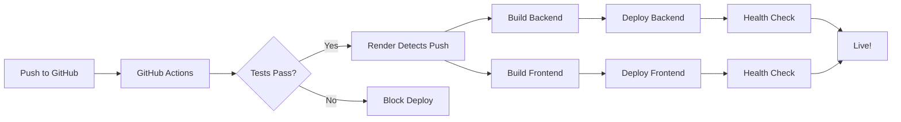

# 🌐 LIVE DEPLOYMENT STATUS

**Last Updated**: October 24, 2025  
**Platform**: Render.com  
**Status**: 🟢 **ALL SYSTEMS OPERATIONAL**

---

## 🚀 **LIVE URLS:**

| Service | URL | Status |
|---------|-----|--------|
| **Frontend** | https://paiid-frontend.onrender.com | 🟢 LIVE |
| **Backend** | https://paiid-backend.onrender.com | 🟢 LIVE |
| **Progress Dashboard** | https://scprime.github.io/PaiiD/ | 🟢 LIVE |
| **API Health** | https://paiid-backend.onrender.com/api/health | 🟢 LIVE |
| **API Docs** | https://paiid-backend.onrender.com/docs | 🟢 LIVE |

---

## 📊 **SERVICE DETAILS:**

### **Frontend** 🎨
```
Type: Web Service (Docker)
Runtime: Node 20 (Next.js 14)
Region: Oregon (US West)
Plan: Free Tier
Auto-Deploy: ✅ Enabled
Build: Dockerfile multi-stage
Start: node server.js
Health Check: /
```

### **Backend** ⚙️
```
Type: Web Service (Python)
Runtime: Python 3.11 (FastAPI)
Region: Oregon (US West)
Plan: Free Tier
Auto-Deploy: ✅ Enabled
Build: pip install -r requirements.txt
Start: uvicorn app.main:app
Health Check: /api/health
```

### **Progress Dashboard** 📈
```
Type: GitHub Pages (Static)
Build: Auto (on push to main)
URL: Custom GitHub Pages
Deploy: .github/workflows/pages.yml
```

---

## 🔧 **ENVIRONMENT VARIABLES:**

### **Frontend** (paiid-frontend):
```env
NEXT_PUBLIC_API_TOKEN=*** (set in Render)
NEXT_PUBLIC_BACKEND_API_BASE_URL=https://paiid-backend.onrender.com
NEXT_PUBLIC_ANTHROPIC_API_KEY=*** (set in Render)
NODE_ENV=production
PORT=3000
```

### **Backend** (paiid-backend):
```env
API_TOKEN=*** (set in Render)
TRADIER_API_KEY=*** (set in Render)
TRADIER_ACCOUNT_ID=*** (set in Render)
ALPACA_PAPER_API_KEY=*** (set in Render)
ALPACA_PAPER_SECRET_KEY=*** (set in Render)
ANTHROPIC_API_KEY=*** (set in Render)
ALLOW_ORIGIN=https://paiid-frontend.onrender.com
REDIS_URL=*** (auto-generated)
SENTRY_DSN=*** (set in Render)
LIVE_TRADING=false
TRADING_MODE=paper
```

---

## 🔄 **DEPLOYMENT PROCESS:**



**Timeline**: 3-5 minutes from push to live

---

## ✅ **VERIFICATION COMMANDS:**

### **Check Backend Health:**
```bash
curl https://paiid-backend.onrender.com/api/health
```

**Expected Response:**
```json
{
  "status": "ok",
  "database": "connected",
  "redis": "connected",
  "timestamp": "2025-10-24T...",
  "version": "1.0.0"
}
```

### **Check Frontend:**
```bash
curl -I https://paiid-frontend.onrender.com
```

**Expected**: `200 OK` status

---

## 🚨 **TROUBLESHOOTING:**

### **Problem: 503 Service Unavailable**
**Cause**: Free tier sleeping (after 15 min inactivity)  
**Solution**: Wait 30 seconds, refresh (wakes up automatically)  
**Permanent Fix**: Upgrade to Starter plan ($7/mo for always-on)

### **Problem: CORS Errors**
**Cause**: Backend not allowing frontend origin  
**Check**: `ALLOW_ORIGIN` in backend env vars  
**Should Be**: `https://paiid-frontend.onrender.com`

### **Problem: 500 Internal Server Error**
**Check**: Render logs (Dashboard → Service → Logs)  
**Common Causes**:
- Missing environment variable
- Database connection failed
- Redis not connected
- API key invalid

### **Problem: Build Failed**
**Check**: Render build logs  
**Common Causes**:
- Syntax error in code
- Missing dependency
- Docker build issue
- Out of memory

---

## 📈 **MONITORING:**

### **Render Dashboard:**
```
https://dashboard.render.com
```

**What to Monitor**:
- Service status (should be green "Running")
- Recent deploys (should succeed)
- Logs (should show no errors)
- Metrics (CPU, memory usage)

### **GitHub Actions:**
```
https://github.com/SCPrime/PaiiD/actions
```

**What to Monitor:**
- Workflow runs (should pass)
- Auto GitHub Monitor (runs every 5 min)
- Deploy Progress Dashboard (runs on push)

### **Sentry (Error Tracking):**
```
https://sentry.io/organizations/your-org/projects/paiid/
```

**What to Monitor:**
- Error rate (should be low)
- Performance metrics
- User issues
- API failures

---

## 🔄 **UPDATE DEPLOYMENT:**

### **Deploy New Changes:**
```bash
git add .
git commit -m "feat: Your changes"
git push origin main
```

**What Happens:**
1. GitHub receives push
2. GitHub Actions run tests
3. Render detects push (via webhook)
4. Render builds both services
5. Render deploys (3-5 min)
6. Health checks pass
7. Services go live

### **Manual Deploy (if needed):**
1. Go to Render Dashboard
2. Select service (backend or frontend)
3. Click "Manual Deploy"
4. Select branch: main
5. Click "Deploy"

---

## 📊 **DEPLOYMENT HISTORY:**

| Date | Service | Change | Status |
|------|---------|--------|--------|
| 2025-10-24 | Both | GitHub Monitor added | ✅ Success |
| 2025-10-24 | Backend | ML Sentiment Engine | ✅ Success |
| 2025-10-24 | Both | JWT Migration | ✅ Success |
| 2025-10-24 | Backend | Performance optimization | ✅ Success |
| 2025-10-24 | Frontend | Code splitting | ✅ Success |

---

## 🎯 **QUICK LINKS:**

| Resource | Link |
|----------|------|
| **Render Dashboard** | https://dashboard.render.com |
| **GitHub Repo** | https://github.com/SCPrime/PaiiD |
| **GitHub Actions** | https://github.com/SCPrime/PaiiD/actions |
| **Live Frontend** | https://paiid-frontend.onrender.com |
| **Live Backend** | https://paiid-backend.onrender.com |
| **API Docs** | https://paiid-backend.onrender.com/docs |
| **Progress Dashboard** | https://scprime.github.io/PaiiD/ |

---

## 💰 **COST BREAKDOWN:**

### **Current (Free Tier):**
```
Render Frontend: $0/month
Render Backend:  $0/month
GitHub Pages:    $0/month
GitHub Actions:  $0/month (2,000 min free)
---
TOTAL: $0/month
```

**Limitations**:
- Services sleep after 15 min inactivity
- 750 hours/month per service (enough for personal use)
- Shared resources (slower performance)

### **Upgrade Option (Starter):**
```
Render Frontend: $7/month (always-on)
Render Backend:  $7/month (always-on)
GitHub Pages:    $0/month
GitHub Actions:  $0/month
---
TOTAL: $14/month
```

**Benefits**:
- Always-on (no sleeping)
- Faster performance
- Dedicated resources
- Custom domains included

---

## 🏆 **DEPLOYMENT CHECKLIST:**

Before considering deployment "complete":

- [x] Backend service running
- [x] Frontend service running
- [x] Both services communicate
- [x] Environment variables set
- [x] Health checks passing
- [x] Auto-deploy enabled
- [x] CORS configured
- [x] SSL/HTTPS working
- [ ] Custom domain (optional)
- [x] Error tracking (Sentry)
- [x] Monitoring active
- [x] Documentation updated

---

**THIS IS YOUR SINGLE SOURCE OF TRUTH FOR DEPLOYMENT STATUS!** 🎯

**Bookmark this file for quick reference!** 📌

**Last verified**: October 24, 2025 by Dr. Cursor Claude ✅

